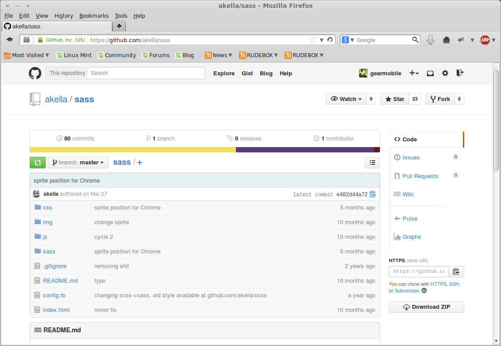

[Назад](./git_start.md) | 
[Вперед](./Настройка_VSCode.md) | 
[Главная](./readme.md)

---

### Git и GitHub

Многие системы контроля версий имеют свой хостинг. Для Git - это **GitGub**. Там хранятся все репозитории каждого пользователя данного сервиса. Туда можно заливать изменения с локального компьютера, копировать чужие проекты для собственных
модификаций (*fork* в github), отправлять запросы на доступ
к чьему-либо проекту. По сути вы работаете с проектом в локальном репозитории и затем вносите эти изменения на удаленный репозиторий, который хранится в github.

