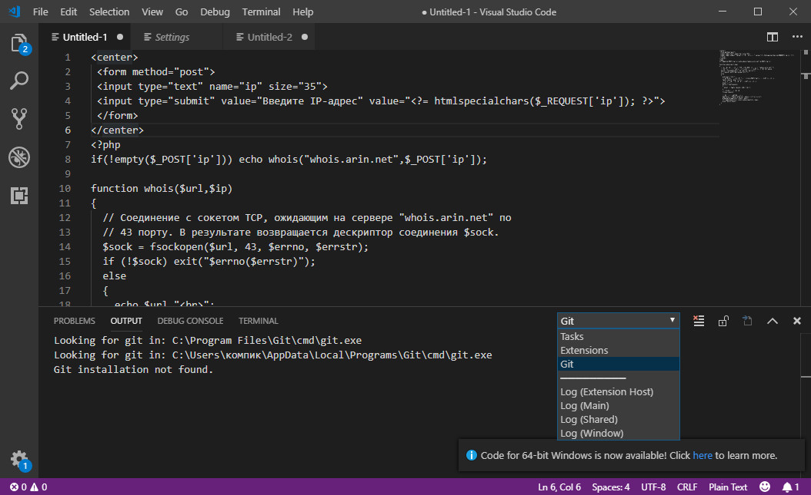

[Назад на главную](./readme.md) | [Вперед](./Git_GitHub.md)

---

### Для чего нужен git?

При создании какого-либо приложения разработчики постоянно вносят изменения в свой продукт. Возникают две проблемы:

  1. Разработчики вносят свои коррективы в общий проект, ничего не зная об изменениях остальных ~~организаторов проблем~~ девелоперов, тем самым создавая так называемые *конфликты*

  2. Сложно ориентироваться в проекте после огромного числа обновлений и изменений.
    Например, после ~~абсолютного краша~~ небольшого бага приложения 
  трудно установить, где именно произошла ошибка, а также какой разработчик занимался проблемной приложения.

Для решения подобных проблем и отслеживания всех шагов, версий и
состояний приложения создали системы контроля версий, и самой популярной на данный момент является **git**. Ее можно скачать на компьютер и пользоваться терминалом git bash. Однако многие *IDE*,
в том числе и Visual Studio Code, которой мы и будем пользоваться в дальнейшем поддерживают git из коробки.

---

[Назад на главную](./readme.md) | [Вперед](./Git_GitHub.md)