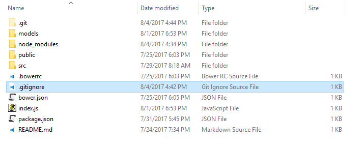

[Назад](./Настройка_VSCode.md) | 
[Вперед](./СоздаемПроект.md) | 
[Главная](./readme.md)

---

### Файл .gitignore

  Проект часто создает файлы которые вы не хотите отслеживать с
помощью git. Это обычно включает файлы генерируемые процессом сборки или временные файлы созданные вашим редактором. Конечно, понятие неотслеживаемые файлы git-ом означает что они не будут обрабатываться при выполнении git add. Но это быстро начинает раздражать, когда вокруг лежат неотслеживаемые файлы; например они могут содержаться в выводе команды "git status".

  Вы можете указать git игнорировать определенные файлы создав файл
.gitignore на самом верхнем уровне рабочей директории.

  Внутри данного файла пишут шаблоны файлов или папок, которые не 
должны войти в индекс. Основную информацию о данном файле можно 
найти [здесь](https://git-scm.com/docs/gitignore), а в разделе 
PATTERN FORMAT можно найти описание шаблонов.

---

[Назад](./Настройка_VSCode.md) | 
[Вперед](./СоздаемПроект.md) | 
[Главная](./readme.md)