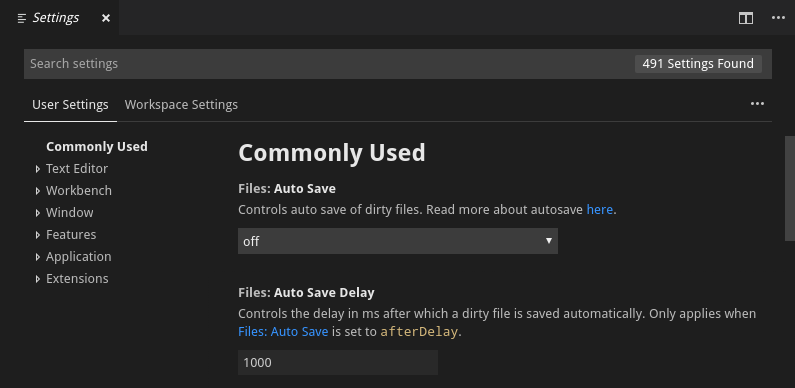

[Назад](./Git_GitHub.md) | 
[Вперед](./gitignore.md) | 
[Главная](./readme.md)

---

### Настройка VSCode

1.Язык интерфейса

В левой части среды разработки нажмите на значек "Extentions".

Далее в поисковике введите russian

Из выведенного списка выберите "Russian Language Pack for Visual Studio Code" и скачайте его

Вкладка View, Command Palette

Вбиваем "Configure Display Language" и нажимаем ru

После скачивания перезагрузите среду разработки как и предлагается в диалоговом окне

2.Автосохранение

Вкладка Файл -> настройки -> параметры

Вбиваем auto save в поисковике

В Auto Save выбираем afterDelay

В Auto Save Delay вводим необходимое время

---

[Назад](./Git_GitHub.md) | 
[Вперед](./gitignore.md) | 
[Главная](./readme.md)